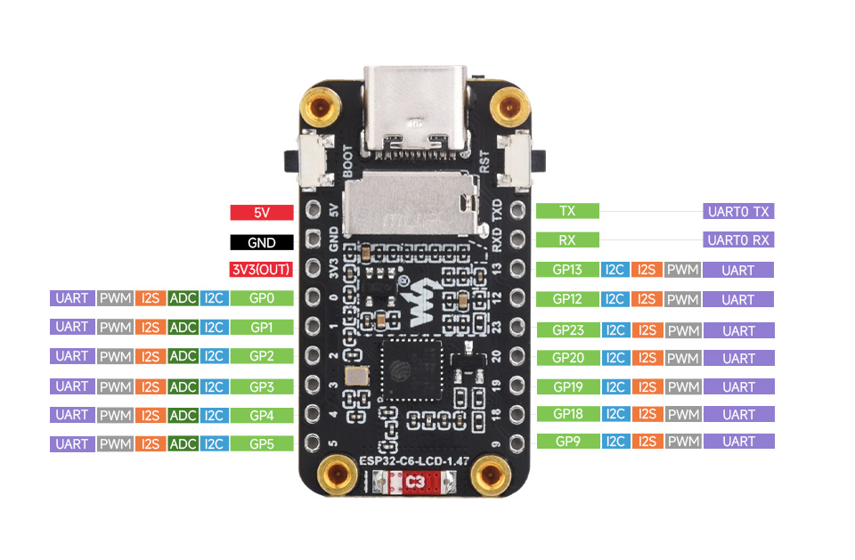

# Board — Waveshare ESP32-C6-LCD-1.47

- **MCU:** ESP32-C6 (RISC-V, Wi-Fi 6, BLE 5, Thread, Zigbee)
- **Flash:** 8 MB
- **Display:** 1.47" IPS, 172 × 320, ST7789 controller, SPI
- **Onboard RGB LED:** WS2812 on **GPIO 8**
- **microSD / TF slot:** on the back of the board
- **USB:** native USB-Serial/JTAG (no extra driver needed on Windows 11 / macOS / Linux)

## Back view (pinout)



## Front view (how you hold it)

Held with the **screen facing you** and the **USB-C cable entering at the bottom**:

```
        ┌───────────────────────┐
        │  1.47" LCD            │
        │  172 × 320            │
        │                       │
        │                       │
        │                       │
        │                       │
        │                       │
        ├───────────────────────┤
 BOOT ──┤ ●   ┌───────────┐   ● ├── RST
 GPIO9  │     │ SD (back) │     │  (EN / hardware reset)
        │     ├───────────┤     │
        │     │   USB-C   │     │
        └─────┴───────────┴─────┘
                  USB-C
```

- **Left button → `BOOT`** (GPIO 9). Hold during reset to force USB download/flash mode.
- **Right button → `RST`** (EN pin, hardware reset — not a readable GPIO).
- **USB-C** on the bottom edge.

## Flash recovery sequence

If upload fails with *"Failed to connect"*: hold **BOOT** (left) → tap **RST** (right) → release **BOOT** → re-run upload.

## Pin reference

From the back-view image above, pins exposed on the two long edges:

| Left edge (top → bottom) | Right edge (top → bottom) |
| ------------------------ | ------------------------- |
| 5V                       | TX (UART0)                |
| GND                      | RX (UART0)                |
| 3V3 (OUT)                | GPIO 13                   |
| GPIO 0                   | GPIO 12                   |
| GPIO 1                   | GPIO 23                   |
| GPIO 2                   | GPIO 20                   |
| GPIO 3                   | GPIO 19                   |
| GPIO 4                   | GPIO 18                   |
| GPIO 5                   | GPIO 9 *(also BOOT)*      |

All GPIO pins support PWM and I2C. GPIOs 0–5 additionally support ADC. Any GPIO can be remapped for SPI/UART/I2S via the ESP32's pin matrix.

## Internal (LCD) pins — already wired on the board

| Signal          | GPIO |
| --------------- | ---- |
| SPI MOSI        | 6    |
| SPI SCLK        | 7    |
| LCD CS          | 14   |
| LCD DC          | 15   |
| LCD RST         | 21   |
| LCD BL (backlight) | 22 |
| WS2812 LED      | 8    |
| BOOT button     | 9    |
